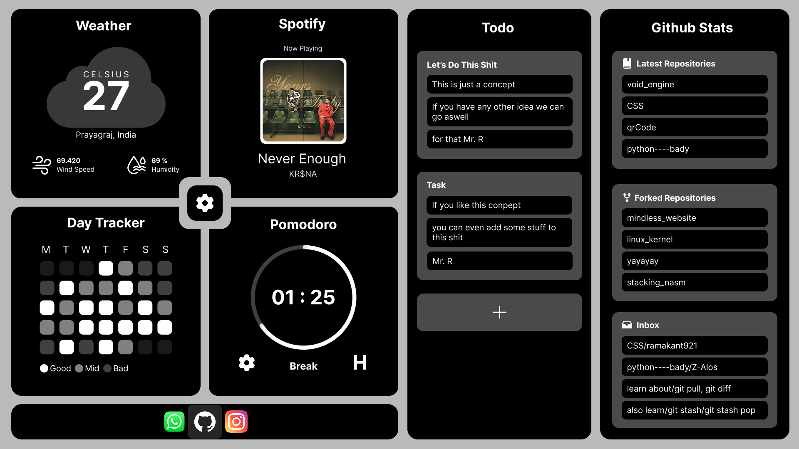

# Daily Dashboard 

## Run This Shit
### backend
- Generate Github Personal Access Token And Add It In The Backend Directory Of This Project
- Install npm Packages
```
npm install

```
- Run The Server
```
cd src/backend
node index.js

```
### frontend 
- just open the main html file in the browser



